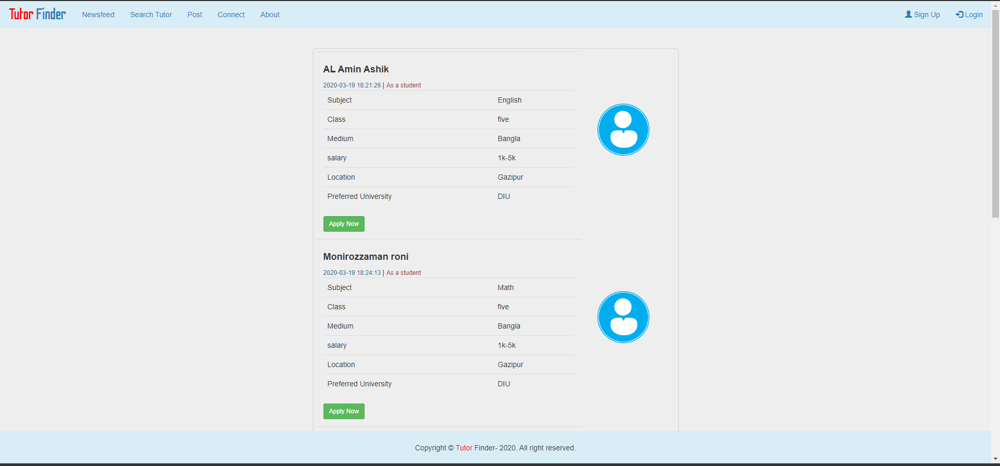
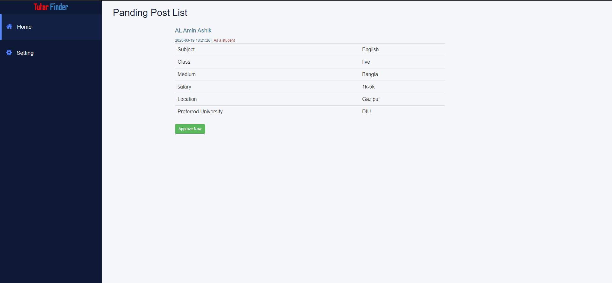

# Tutor Finder

### How to run this project ?

#### step 1: Download this project from github
#### step 2: open Xampp
#### step 3: goto phpMyAdmin panel [http://localhost:80/phpmyadmin/](http://localhost:80/phpmyadmin/)
#### step 4: import ``tutorfinder.sql``( from `sql` folder) file in phpMyAdmin panel
#### step 5: copy project folder and peast that ``C:\xampp\htdocs`` this location
#### step 6: Run this link [http://localhost:80/Onliner%20Tutor%20Finder/html/](http://localhost:80/Onliner%20Tutor%20Finder/html/)
#
#### Admin Panel
###### Username : admin
###### Password: admin
# 
### Project View :
Index Page

Admin Login

Admin Dashboard

